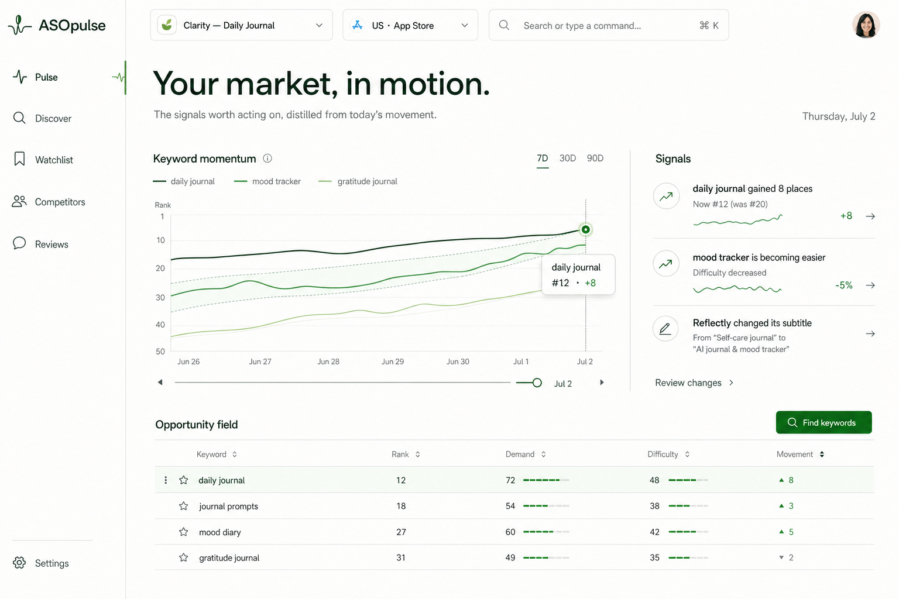

# ASOpulse

**A transparent, self-hosted App Store keyword workspace.** Track daily rankings, research keywords, and understand every signal without invented search-volume metrics.

[](https://github.com/ayushhagarwal/asopulse/actions/workflows/ci.yml)
[](https://github.com/ayushhagarwal/asopulse/actions/workflows/codeql.yml)
[](LICENSE)
[](https://github.com/ayushhagarwal/asopulse/releases)

| [Overview](#overview) | [Quick start](#quick-start) | [Local setup](#local-setup) | [Self-host](#self-host) | [Screenshots](#screenshots) | [Architecture](#architecture) | [Security](#security) | [Contributing](#contributing) | [Roadmap](#roadmap) | [License](#license) |
|:---:|:---:|:---:|:---:|:---:|:---:|:---:|:---:|:---:|:---:|

> **Project status:** Early release (`v0.x`). The backup format is versioned and migrations preserve existing observations, but review release notes before every upgrade.

## Overview

ASOpulse keeps one independent dataset per app and App Store market. It records daily keyword positions, preserves missing observations as gaps, and shows exactly when and how each derived metric was produced.

- **Pulse:** freshness, actionable signals, and top movers without a dashboard-sized chart.
- **Track:** searchable and sortable keyword table, 7/30/90-day movement, sparklines, selected refreshes, and rank history through position 200.
- **Discover:** research based on observable public App Store results—never fabricated volume.
- **Markets:** switch between saved storefronts while keeping their histories isolated.
- **Scheduling:** daily, weekdays, or weekly observations at a local time and IANA timezone.
- **Ownership:** PostgreSQL is authoritative, Redis/BullMQ coordinates work, and telemetry is off by default.

ASOpulse currently targets Apple App Store public search data. It does **not** include App Store Connect, Apple Ads, Google Play, teams, billing, AI copywriting, competitor data dumps, or review scraping.

## Quick start

The fastest local evaluation uses Docker Compose:

```bash
git clone https://github.com/ayushhagarwal/asopulse.git
cd asopulse
cp .env.example .env
# Replace POSTGRES_PASSWORD and SESSION_SECRET in .env.
docker compose up -d --build
```

Open <http://localhost:8080>, create the first owner account, and add an app. Check health with:

```bash
docker compose ps
docker compose logs --tail=100 api worker
```

For source development with hot reload, follow [Local setup](docs/local-setup.md).

## Local setup

Clone the repo, make sure Docker Desktop is running, then either follow the [manual local setup guide](docs/local-setup.md) or ask Codex/Claude to run it from the repo root:

```text
Set up ASOpulse locally from this fresh clone. Use Docker Desktop for PostgreSQL and Redis, create .env from .env.example with safe local secrets, install dependencies, run migrations, start the dev server, and verify the web app and API health. Follow skills/local-setup/SKILL.md if present.
```

Agent setup instructions live in [`skills/local-setup/SKILL.md`](skills/local-setup/SKILL.md). They are intentionally plain Markdown so they can be pasted into Codex, Claude, or another coding agent.

## Self-host

Self-hosting is the primary deployment model. Use either:

- [`docker-compose.yml`](docker-compose.yml) to build from source; or
- [`docker-compose.release.yml`](docker-compose.release.yml) with published GHCR images and an `ASOPULSE_VERSION` such as `v0.1.0`.

Production deployments must use HTTPS, a unique 32+ character `SESSION_SECRET`, non-default database credentials, persistent PostgreSQL and Redis volumes, and a tested backup/restore process. PostgreSQL and Redis should never be exposed publicly.

Read the complete [self-hosting and upgrade guide](docs/self-hosting.md), including reverse-proxy headers, rollback constraints, backups, and migration behavior.

### Environment

| Variable | Required | Purpose |
| --- | --- | --- |
| `POSTGRES_PASSWORD` | Yes | PostgreSQL owner password. |
| `DATABASE_URL` | Yes outside Compose | PostgreSQL connection string. |
| `REDIS_URL` | Yes | BullMQ and provider-throttling connection. |
| `SESSION_SECRET` | Yes | Signed session secret; production rejects weak placeholders. |
| `WEB_ORIGIN` | Yes | Exact browser origin allowed by CORS. |
| `NODE_ENV` | Production | Enables secure cookies and production safeguards. |
| `API_DOCS_ENABLED` | No | Exposes Swagger UI in production only when explicitly `true`. |
| `ASOPULSE_VERSION` | Release Compose | GHCR image tag; pin an immutable SemVer release. |

Schedules are stored per project; there is no global cron environment variable.

## Screenshots



## Architecture

ASOpulse is a pnpm/Turborepo TypeScript monorepo:

```text
Browser (React + Vite)
        │ /api
        ▼
Fastify API ─── PostgreSQL (users, projects, observations)
        │
        └────── Redis + BullMQ ─── Worker ─── Apple public search provider
```

The API owns authentication and project isolation. Workers record fresh observations. History is aggregated by project-local calendar day using the latest observation in each day. See [Architecture](docs/architecture.md), [Data sources](docs/data-sources.md), and the [public-data ADR](docs/adr/0001-public-data-only-v1.md).

## Security

Do not open a public issue for a vulnerability. Use GitHub's **Report a vulnerability** flow described in [SECURITY.md](SECURITY.md). Public bug reports belong in Issues; setup questions and product ideas belong in Discussions.

## Contributing

Read [CONTRIBUTING.md](CONTRIBUTING.md) and the [Code of Conduct](CODE_OF_CONDUCT.md). Before opening a pull request, run:

```bash
pnpm check
pnpm typecheck
pnpm test
pnpm build
pnpm audit --audit-level=high
pnpm licensecheck
```

## Roadmap

See [docs/roadmap.md](docs/roadmap.md). Feature requests should explain the user problem, data source, privacy impact, and why the result remains inspectable.

## Troubleshooting

- **API cannot connect:** wait for PostgreSQL and Redis health checks, then inspect `docker compose logs api`.
- **Migration fails:** restore the pre-upgrade database backup before running the older image; do not assume migrations are reversible.
- **No rank yet:** initial and manual refreshes are queued; inspect the latest run status and worker logs.
- **Secure cookie missing:** production login requires HTTPS and the correct `WEB_ORIGIN`.
- **Apple search throttles:** wait for the queued retry; do not run multiple workers against separate Redis instances.

## License

ASOpulse is licensed under [GNU AGPL-3.0-only](LICENSE). Network users must be offered the complete corresponding source for the running version, including modifications.
